# hakoniwa-pdu-foxglove

`hakoniwa-pdu-foxglove` provides a Foxglove output adapter for
[`hakoniwa-pdu-endpoint`](https://github.com/hakoniwalab/hakoniwa-pdu-endpoint).

The initial implementation streams **caller-provided CDR payloads** to Foxglove
through the official Foxglove SDK WebSocket server. The CDR bytes are forwarded
without deserialization or re-serialization.

> Status: version 0.1 initial implementation.

## Goal

Provide a small, reusable component that connects Hakoniwa's binary-oriented
Endpoint abstraction to Foxglove live visualization.

The first release should:

- implement an output-only `FoxgloveComm` adapter derived from
  `hakoniwa::pdu::PduComm`;
- use the official Foxglove C++ SDK and its `WebSocketServer` and `RawChannel`
  APIs;
- publish CDR payloads with an explicitly configured schema;
- preserve the payload bytes exactly as supplied by the caller;
- use `hakoniwa-pdu-registry` as the authoritative source for PDU types, CDR
  codecs, and schema assets;
- remain independent from the `hakoniwa-pdu-endpoint` factory in the first
  implementation by using `Endpoint::set_comm()`.

## Important data contract

`PduComm` is a binary transport boundary. It does not guarantee that the bytes
passed to `send()` are CDR.

Therefore, this repository defines the following contract:

```text
FoxgloveComm::send(...) input = complete Foxglove-compatible CDR payload
```

The caller, typed wrapper, or bridge layer is responsible for converting a
Hakoniwa typed/raw PDU into CDR before calling the Endpoint. Generated CDR
converters from `hakoniwa-pdu-registry` should be used for that conversion.

`FoxgloveComm` must not guess the input representation and must not silently
convert Hakoniwa's native PDU binary format.

## Architecture

```mermaid
flowchart LR
    APP[Application / Codec Layer]
    REG[hakoniwa-pdu-registry]
    EP[hakoniwa-pdu-endpoint\nEndpoint OUT]
    COM[FoxgloveComm\nPduComm adapter]
    PUB[FoxglovePublisher\nEndpoint-independent boundary]
    SDK[Foxglove SDK\nRawChannel + WebSocketServer]
    UI[Foxglove App]

    REG -->|CDR converter + schema| APP
    APP -->|complete CDR payload| EP
    EP -->|PduResolvedKey + opaque bytes| COM
    COM --> PUB
    PUB --> SDK
    SDK -->|Foxglove WebSocket| UI
```



The design is intentionally split into two layers:

1. **`FoxglovePublisher`** owns Foxglove SDK objects, server lifecycle, channel
   registration, and raw message publication.
2. **`FoxgloveComm`** adapts `hakoniwa::pdu::PduComm` to
   `FoxglovePublisher`, resolves PDU keys, and translates errors into
   `HakoPduErrorType`.

This keeps the Foxglove-specific core reusable without coupling all behavior to
Endpoint lifecycle details.

## Initial scope

Version 0.1 is deliberately narrow.

### Included

- C++20 and CMake build
- official Foxglove C++ SDK integration
- one local WebSocket server
- configurable host, port, and server name
- output-only publication
- one Foxglove `RawChannel` per configured Hakoniwa PDU mapping
- message encoding fixed to `cdr`
- explicit schema name, schema encoding, and schema file
- schema encodings supported by configuration:
  - `omgidl` for OMG IDL schema data
  - `ros2msg` or `ros2idl` when the selected registry artifact requires the
    corresponding ROS 2 schema representation
- wall-clock log time for the first implementation
- unit tests that do not require the Foxglove application
- a manual live-visualization smoke example

### Not included

- Foxglove UI, panels, or extensions
- conversion to Foxglove native message types such as `PoseInFrame`
- automatic conversion from Hakoniwa native PDU binary to CDR
- Foxglove-to-Hakoniwa client publishing
- services, parameters, assets, or connection graph capabilities
- simulation-time broadcasting
- MCAP recording
- dynamic channel creation after startup
- modification of the `hakoniwa-pdu-endpoint` protocol factory

These may be added only after the raw CDR publication path is validated.

## Endpoint lifecycle mapping

The first implementation should follow the existing `PduComm` lifecycle.

| `PduComm` method | Foxglove behavior |
|---|---|
| `set_pdu_definition()` | Receive the PDU definition used to resolve `(robot, pdu)` into `(robot, channel_id)` |
| `open(config_path)` | Parse and validate configuration, resolve PDU mappings, and load schema files; no network side effects |
| `start()` | Create the Foxglove context, WebSocket server, and raw channels, then enter the running state |
| `send(key, data)` | Find the configured channel and log the supplied CDR bytes without modification |
| `recv(...)` | Return `HAKO_PDU_ERR_UNSUPPORTED` |
| `recv_next(...)` | Return `HAKO_PDU_ERR_UNSUPPORTED` |
| `stop()` | Stop publication, close channels, and stop the WebSocket server |
| `close()` | Idempotently stop and release all resources and loaded configuration |
| `is_running()` | Report the adapter lifecycle state |

`open()`, `start()`, `stop()`, and `close()` must have explicit and testable
state transitions. Calling `stop()` or `close()` more than once must be safe.

## Configuration outline

The implemented communication config schema is:

```json
{
  "protocol": "foxglove",
  "server": {
    "name": "hakoniwa-pdu-foxglove",
    "host": "127.0.0.1",
    "port": 8765
  },
  "channels": [
    {
      "pdu_key": {
        "robot": "FoxgloveDemo",
        "pdu": "sim_time"
      },
      "topic": "/hakoniwa/FoxgloveDemo/sim_time",
      "schema": {
        "name": "hako_msgs/msg/SimTime",
        "encoding": "ros2msg",
        "file": "../../hakoniwa-pdu-registry/idl/hako_msgs/msg/SimTime.msg"
      }
    }
  ]
}
```

Rules:

- paths are resolved relative to the Foxglove communication config file;
- `message_encoding` is fixed to `cdr` for version 0.1;
- the schema encoding is explicit and must match the schema file contents;
- no implicit fallback between `omgidl`, `ros2msg`, and `ros2idl` is allowed;
- duplicate topics, duplicate PDU keys, unresolved PDU definitions, missing
  schema files, unsupported schema encodings, and invalid ports are
  configuration errors;
- the topic name should be configurable rather than derived invisibly;
- the implementation should retain schema bytes for at least as long as the
  corresponding Foxglove channel exists.

## Expected repository layout

```text
hakoniwa-pdu-foxglove/
├── README.md
├── task.md
├── CMakeLists.txt
├── build.bash
├── cmake/
│   └── FoxgloveSdk.cmake
├── include/
│   └── hakoniwa/pdu/foxglove/
│       ├── foxglove_publisher.hpp
│       └── comm_foxglove.hpp
├── src/
│   ├── foxglove_publisher.cpp
│   └── comm_foxglove.cpp
├── config/
│   └── sample/
│       ├── endpoint_foxglove.json
│       └── comm_foxglove.json
├── examples/
│   └── cdr-publisher/
│       └── main.cpp
├── test/
│   ├── test_config.cpp
│   ├── test_comm_foxglove.cpp
│   └── test_publisher.cpp
├── hakoniwa-pdu-endpoint/
└── hakoniwa-pdu-registry/
```

The final layout may vary slightly, but the separation between the generic
Foxglove publisher and the Endpoint communication adapter must remain clear.

## Dependencies

- C++20 compiler
- CMake 3.20 or later
- `hakoniwa-pdu-endpoint` submodule
- `hakoniwa-pdu-registry` submodule
- official Foxglove C++ SDK, pinned to a specific release and checksum
- GoogleTest for tests
- `nlohmann_json` through the existing Endpoint dependency or an explicit CMake
  dependency

The Foxglove SDK is available under the MIT license and provides C++, Python,
and Rust bindings. Its C++ release archive includes a CMake package config and
prebuilt C library. Follow the official installation guidance rather than
building the SDK's Rust core as part of this project.

## Build and Test

Initialize submodules first:

```bash
git submodule update --init --recursive
```

Build:

```bash
./build.bash
```

Run tests:

```bash
./test.bash
```

The build creates:

- `hakoniwa_pdu_foxglove`
- `cdr_publisher_example`
- `hakoniwa_pdu_foxglove_tests`

## Foxglove SDK Pin

The CMake integration uses the official Foxglove C++ SDK release archive and
its package config from `foxglove/foxglove-sdk`.

- SDK release: `sdk/v0.25.2`
- macOS arm64 archive:
  `foxglove-v0.25.2-cpp-aarch64-apple-darwin.zip`
  - SHA256:
    `8839bde7c4e1142e7cbbf57756d87d2e36a683fad6fb32cbc240038d6e781ad8`
- macOS x86_64 archive:
  `foxglove-v0.25.2-cpp-x86_64-apple-darwin.zip`
  - SHA256:
    `3ef620496dde842bc35201f87c33cf94e3b3b2b5b5fb8f057ad64bcf0b12238b`
- Linux aarch64 archive:
  `foxglove-v0.25.2-cpp-aarch64-unknown-linux-gnu.zip`
  - SHA256:
    `72d403cc2ee90e84bd803c08e7dcaa2ddf5175d381f9668b595357a9445c39b6`
- Linux x86_64 archive:
  `foxglove-v0.25.2-cpp-x86_64-unknown-linux-gnu.zip`
  - SHA256:
    `ac001974aa0e3ac5b8159bcd698007c0661715c4a0201c99353e8a8dfe03bd44`

CMake selects the archive from `CMAKE_SYSTEM_NAME` and
`CMAKE_SYSTEM_PROCESSOR`. Set `HAKO_PDU_FOXGLOVE_USE_SYSTEM_FOXGLOVE_SDK=ON`
to use an already installed `foxglove-sdk` package instead.

## CDR Publisher Example

The sample publishes `hako_msgs/SimTime`:

- smoke-test PDU type: `hako_msgs/SimTime`
- PDU definition: `config/sample/pdudef.json` and
  `config/sample/pdutypes.json`
- registry schema artifact:
  `hakoniwa-pdu-registry/idl/hako_msgs/msg/SimTime.msg`
- Foxglove schema encoding: `ros2msg`
- generated registry CDR converter:
  `hakoniwa-pdu-registry/pdu/types/hako_msgs/pdu_cpptype_cdr_conv_SimTime.hpp`
- payload: complete DDS CDR payload, including CDR encapsulation
- topic: `/hakoniwa/FoxgloveDemo/sim_time`

Run from the repository root:

```bash
./build/cdr_publisher_example config/sample/endpoint_foxglove.json
```

The example constructs `FoxgloveComm`, injects it with `Endpoint::set_comm()`,
uses the generated `SimTimeCdr` converter, and publishes a changing
`time_usec` value. Press `Ctrl-C` to stop.

For a short smoke run:

```bash
./build/cdr_publisher_example config/sample/endpoint_foxglove.json 3
```

The default sample WebSocket address is:

```text
ws://127.0.0.1:8765
```

If that port is already in use, edit `config/sample/comm_foxglove.json` and
change `server.port`, then run the example again.

In Foxglove:

1. Open Foxglove.
2. Choose **Open connection**.
3. Connect to the printed WebSocket address.
4. Confirm topic `/hakoniwa/FoxgloveDemo/sim_time`.
5. In Raw Messages, confirm `time_usec` is decoded.
6. In Plot, select `time_usec` for a numeric plot.

## Docker Live Smoke

The Docker setup builds the project in an Ubuntu container, runs CTest, and
starts the existing CDR publisher example. Foxglove itself is not Dockerized;
run the Foxglove desktop or web app on the host and connect to the container's
WebSocket server.

The Docker image uses the same CMake configuration as the local build, including
the pinned Foxglove SDK release in `cmake/FoxgloveSdk.cmake`. Docker-specific
runtime config is kept under `docker/config/` and is separate from
`config/sample/`.

Initialize submodules before building the image:

```bash
git submodule update --init --recursive
```

Build the Ubuntu image:

```bash
docker compose -f docker/docker-compose.yml build
```

Run CTest inside the container:

```bash
docker compose -f docker/docker-compose.yml run --rm --no-deps hakoniwa-pdu-foxglove \
  ctest --test-dir build --output-on-failure
```

Start the CDR publisher:

```bash
docker compose -f docker/docker-compose.yml up --force-recreate hakoniwa-pdu-foxglove
```

The container binds the Foxglove WebSocket server to `0.0.0.0:8765` and exposes
it to the host as:

```text
ws://localhost:8765
```

The Docker publisher topic is:

```text
/hakoniwa/FoxgloveDocker/sim_time
```

For a single command that builds, runs CTest, and then starts the publisher in
the foreground:

```bash
./docker/run-smoke-test.bash
```

In Foxglove on the host:

1. Open Foxglove Desktop, or open `https://app.foxglove.dev/` in a browser and
   log in.
2. If the first-run framework setup screen appears, choose **Go to dashboard**.
   The ROS 1, ROS 2, PX4, and custom framework choices are not required for
   this WebSocket smoke test.
3. Choose **Open connection**.
4. Select **Foxglove WebSocket**.
5. Connect to `ws://localhost:8765`.
6. Confirm the topic tree shows `/hakoniwa/FoxgloveDocker/sim_time`.
7. Confirm the decoded field appears as `_time_usec` with type `uint64`.

To inspect decoded CDR fields:

1. Add or change a panel to **Raw Messages**.
2. Enter this message path:

   ```text
   /hakoniwa/FoxgloveDocker/sim_time
   ```

3. Confirm `_time_usec` is decoded and increasing.

To plot the numeric field:

1. Add or change a panel to **Plot**.
2. Enter this message path:

   ```text
   /hakoniwa/FoxgloveDocker/sim_time._time_usec
   ```

3. Confirm the plotted value increases over time.

The 3D and Image panels do not show this sample because the Docker smoke data is
only a `SimTime` CDR message with one numeric field.

To verify reconnect behavior after a container restart:

```bash
docker compose -f docker/docker-compose.yml restart hakoniwa-pdu-foxglove
```

Then reconnect Foxglove to `ws://localhost:8765`.

Stop the Docker publisher:

```bash
docker compose -f docker/docker-compose.yml down
```

## Current Verification

Verified on macOS arm64:

```text
./test.bash
100% tests passed, 0 tests failed out of 1

./build/cdr_publisher_example /private/tmp/hako-foxglove-sample/endpoint_foxglove.json 3
published time_usec=0 bytes=12
published time_usec=100000 bytes=12
published time_usec=200000 bytes=12
```

The example smoke was run with a temporary copy of the sample config using
port `18765` because port `8765` was already unavailable in the sandboxed run.
The sandbox blocks local bind; the WebSocket smoke was verified outside the
sandbox. Foxglove UI visual confirmation remains a manual step.

Verified with Docker on Ubuntu 24.04:

```text
docker compose -f docker/docker-compose.yml build
...
100% tests passed, 0 tests failed out of 1

docker compose -f docker/docker-compose.yml run --rm --no-deps hakoniwa-pdu-foxglove \
  ctest --test-dir build --output-on-failure
...
100% tests passed, 0 tests failed out of 1

docker compose -f docker/docker-compose.yml up -d --force-recreate hakoniwa-pdu-foxglove
docker compose -f docker/docker-compose.yml logs --tail=30 hakoniwa-pdu-foxglove
...
published time_usec=10100000 bytes=12
```

Foxglove UI confirmation is manual because it requires the host Foxglove app.

References:

- [Foxglove SDK](https://docs.foxglove.dev/docs/sdk)
- [Foxglove WebSocket server](https://docs.foxglove.dev/docs/sdk/websocket-server)
- [Foxglove custom schema encodings](https://docs.foxglove.dev/docs/getting-started/custom/custom-schema-encodings)
- [foxglove/foxglove-sdk](https://github.com/foxglove/foxglove-sdk)

## Verification strategy

Automated tests must cover:

- valid and invalid configuration parsing;
- relative schema-path resolution;
- PDU name-to-channel resolution through `PduDefinition`;
- duplicate mapping rejection;
- lifecycle idempotency;
- `send()` before `start()`;
- unknown PDU keys;
- unsupported receive operations;
- exact forwarding of the input byte sequence to the publisher boundary;
- clean shutdown after partial startup failure.

The manual smoke test should:

1. create a known CDR payload using a generated registry converter;
2. publish it through an Endpoint with an injected `FoxgloveComm`;
3. start the server on `127.0.0.1:8765`;
4. connect from Foxglove;
5. confirm that the topic, schema, and decoded fields appear in Raw Messages;
6. confirm that a numeric field can be selected in Plot where applicable.

## Roadmap

### Version 0.1 — Raw CDR live publication

Validate the smallest useful path: explicit schema plus untouched CDR payload
through Foxglove WebSocket.

### Version 0.2 — Hakoniwa time integration

Optionally expose the Foxglove `Time` capability and broadcast Hakoniwa
simulation time.

### Version 0.3 — Visualization mappings

Add opt-in converters for selected PDU types to Foxglove native schemas such as
pose, transforms, images, and point clouds. Keep the raw CDR path available.

### Version 0.4 — Bidirectional control, only when justified

Evaluate Foxglove `ClientPublish` support for command PDUs. This is not assumed
to be necessary for the initial business pack.
