# hakoniwa-pdu-foxglove

`hakoniwa-pdu-foxglove` provides a Foxglove output adapter for
[`hakoniwa-pdu-endpoint`](https://github.com/hakoniwalab/hakoniwa-pdu-endpoint).

The initial implementation streams **caller-provided CDR payloads** to Foxglove
through the official Foxglove SDK WebSocket server. The CDR bytes are forwarded
without deserialization or re-serialization.

> Status: initial design. See [`task.md`](task.md) for the first implementation
> task and acceptance criteria.

## Goal

Provide a small, reusable component that connects Hakoniwa's binary-oriented
Endpoint abstraction to Foxglove live visualization.

The first release should:

- implement an output-only `FoxgloveComm` adapter derived from
  `hakoniwa::pdu::PduComm`;
- use the official Foxglove C++ SDK and its `WebSocketServer` and `RawChannel`
  APIs;
- publish CDR payloads with an explicitly configured schema;
- preserve the payload bytes exactly as supplied by the caller;
- use `hakoniwa-pdu-registry` as the authoritative source for PDU types, CDR
  codecs, and schema assets;
- remain independent from the `hakoniwa-pdu-endpoint` factory in the first
  implementation by using `Endpoint::set_comm()`.

## Important data contract

`PduComm` is a binary transport boundary. It does not guarantee that the bytes
passed to `send()` are CDR.

Therefore, this repository defines the following contract:

```text
FoxgloveComm::send(...) input = complete Foxglove-compatible CDR payload
```

The caller, typed wrapper, or bridge layer is responsible for converting a
Hakoniwa typed/raw PDU into CDR before calling the Endpoint. Generated CDR
converters from `hakoniwa-pdu-registry` should be used for that conversion.

`FoxgloveComm` must not guess the input representation and must not silently
convert Hakoniwa's native PDU binary format.

## Architecture

```mermaid
flowchart LR
    APP[Application / Codec Layer]
    REG[hakoniwa-pdu-registry]
    EP[hakoniwa-pdu-endpoint\nEndpoint OUT]
    COM[FoxgloveComm\nPduComm adapter]
    PUB[FoxglovePublisher\nSDK-independent boundary]
    SDK[Foxglove SDK\nRawChannel + WebSocketServer]
    UI[Foxglove App]

    REG -->|CDR converter + schema| APP
    APP -->|complete CDR payload| EP
    EP -->|PduResolvedKey + opaque bytes| COM
    COM --> PUB
    PUB --> SDK
    SDK -->|Foxglove WebSocket| UI
```



The design is intentionally split into two layers:

1. **`FoxglovePublisher`** owns Foxglove SDK objects, server lifecycle, channel
   registration, and raw message publication.
2. **`FoxgloveComm`** adapts `hakoniwa::pdu::PduComm` to
   `FoxglovePublisher`, resolves PDU keys, and translates errors into
   `HakoPduErrorType`.

This keeps the Foxglove-specific core reusable without coupling all behavior to
Endpoint lifecycle details.

## Initial scope

Version 0.1 is deliberately narrow.

### Included

- C++20 and CMake build
- official Foxglove C++ SDK integration
- one local WebSocket server
- configurable host, port, and server name
- output-only publication
- one Foxglove `RawChannel` per configured Hakoniwa PDU mapping
- message encoding fixed to `cdr`
- explicit schema name, schema encoding, and schema file
- schema encodings supported by configuration:
  - `omgidl` for OMG IDL schema data
  - `ros2msg` or `ros2idl` when the selected registry artifact requires the
    corresponding ROS 2 schema representation
- wall-clock log time for the first implementation
- unit tests that do not require the Foxglove application
- a manual live-visualization smoke example

### Not included

- Foxglove UI, panels, or extensions
- conversion to Foxglove native message types such as `PoseInFrame`
- automatic conversion from Hakoniwa native PDU binary to CDR
- Foxglove-to-Hakoniwa client publishing
- services, parameters, assets, or connection graph capabilities
- simulation-time broadcasting
- MCAP recording
- dynamic channel creation after startup
- modification of the `hakoniwa-pdu-endpoint` protocol factory

These may be added only after the raw CDR publication path is validated.

## Endpoint lifecycle mapping

The first implementation should follow the existing `PduComm` lifecycle.

| `PduComm` method | Foxglove behavior |
|---|---|
| `set_pdu_definition()` | Receive the PDU definition used to resolve `(robot, pdu)` into `(robot, channel_id)` |
| `open(config_path)` | Parse and validate configuration, resolve PDU mappings, and load schema files; no network side effects |
| `start()` | Create the Foxglove context, WebSocket server, and raw channels, then enter the running state |
| `send(key, data)` | Find the configured channel and log the supplied CDR bytes without modification |
| `recv(...)` | Return `HAKO_PDU_ERR_UNSUPPORTED` |
| `recv_next(...)` | Return `HAKO_PDU_ERR_UNSUPPORTED` |
| `stop()` | Stop publication, close channels, and stop the WebSocket server |
| `close()` | Idempotently stop and release all resources and loaded configuration |
| `is_running()` | Report the adapter lifecycle state |

`open()`, `start()`, `stop()`, and `close()` must have explicit and testable
state transitions. Calling `stop()` or `close()` more than once must be safe.

## Configuration outline

The exact schema is part of the first implementation task. The intended shape
is:

```json
{
  "protocol": "foxglove",
  "server": {
    "name": "hakoniwa-pdu-foxglove",
    "host": "127.0.0.1",
    "port": 8765
  },
  "channels": [
    {
      "pdu_key": {
        "robot": "Drone",
        "pdu": "pos"
      },
      "topic": "/hakoniwa/Drone/pos",
      "schema": {
        "name": "geometry_msgs::msg::Pose",
        "encoding": "omgidl",
        "file": "<path-to-verified-schema-artifact>"
      }
    }
  ]
}
```

Rules:

- paths are resolved relative to the Foxglove communication config file;
- `message_encoding` is fixed to `cdr` for version 0.1;
- the schema encoding is explicit and must match the schema file contents;
- no implicit fallback between `omgidl`, `ros2msg`, and `ros2idl` is allowed;
- duplicate topics, duplicate PDU keys, unresolved PDU definitions, missing
  schema files, unsupported schema encodings, and invalid ports are
  configuration errors;
- the topic name should be configurable rather than derived invisibly;
- the implementation should retain schema bytes for at least as long as the
  corresponding Foxglove channel exists.

## Expected repository layout

```text
hakoniwa-pdu-foxglove/
├── README.md
├── task.md
├── CMakeLists.txt
├── build.bash
├── cmake/
│   └── FoxgloveSdk.cmake
├── include/
│   └── hakoniwa/pdu/foxglove/
│       ├── foxglove_publisher.hpp
│       └── comm_foxglove.hpp
├── src/
│   ├── foxglove_publisher.cpp
│   └── comm_foxglove.cpp
├── config/
│   └── sample/
│       ├── endpoint_foxglove.json
│       └── comm_foxglove.json
├── examples/
│   └── cdr-publisher/
│       └── main.cpp
├── test/
│   ├── test_config.cpp
│   ├── test_comm_foxglove.cpp
│   └── test_publisher.cpp
├── hakoniwa-pdu-endpoint/
└── hakoniwa-pdu-registry/
```

The final layout may vary slightly, but the separation between the generic
Foxglove publisher and the Endpoint communication adapter must remain clear.

## Dependencies

- C++20 compiler
- CMake 3.20 or later
- `hakoniwa-pdu-endpoint` submodule
- `hakoniwa-pdu-registry` submodule
- official Foxglove C++ SDK, pinned to a specific release and checksum
- GoogleTest for tests
- `nlohmann_json` through the existing Endpoint dependency or an explicit CMake
  dependency

The Foxglove SDK is available under the MIT license and provides C++, Python,
and Rust bindings. Its C++ release archive includes a CMake package config and
prebuilt C library. Follow the official installation guidance rather than
building the SDK's Rust core as part of this project.

References:

- [Foxglove SDK](https://docs.foxglove.dev/docs/sdk)
- [Foxglove WebSocket server](https://docs.foxglove.dev/docs/sdk/websocket-server)
- [Foxglove custom schema encodings](https://docs.foxglove.dev/docs/getting-started/custom/custom-schema-encodings)
- [foxglove/foxglove-sdk](https://github.com/foxglove/foxglove-sdk)

## Verification strategy

Automated tests must cover:

- valid and invalid configuration parsing;
- relative schema-path resolution;
- PDU name-to-channel resolution through `PduDefinition`;
- duplicate mapping rejection;
- lifecycle idempotency;
- `send()` before `start()`;
- unknown PDU keys;
- unsupported receive operations;
- exact forwarding of the input byte sequence to the publisher boundary;
- clean shutdown after partial startup failure.

The manual smoke test should:

1. create a known CDR payload using a generated registry converter;
2. publish it through an Endpoint with an injected `FoxgloveComm`;
3. start the server on `127.0.0.1:8765`;
4. connect from Foxglove;
5. confirm that the topic, schema, and decoded fields appear in Raw Messages;
6. confirm that a numeric field can be selected in Plot where applicable.

## Roadmap

### Version 0.1 — Raw CDR live publication

Validate the smallest useful path: explicit schema plus untouched CDR payload
through Foxglove WebSocket.

### Version 0.2 — Hakoniwa time integration

Optionally expose the Foxglove `Time` capability and broadcast Hakoniwa
simulation time.

### Version 0.3 — Visualization mappings

Add opt-in converters for selected PDU types to Foxglove native schemas such as
pose, transforms, images, and point clouds. Keep the raw CDR path available.

### Version 0.4 — Bidirectional control, only when justified

Evaluate Foxglove `ClientPublish` support for command PDUs. This is not assumed
to be necessary for the initial business pack.
