# hakoniwa-pdu-foxglove

`hakoniwa-pdu-foxglove` is an output adapter that connects
[`hakoniwa-pdu-endpoint`](https://github.com/hakoniwalab/hakoniwa-pdu-endpoint)
to Foxglove live visualization.

Version 0.1 publishes **caller-provided, Foxglove-compatible CDR payloads**
through the official Foxglove SDK WebSocket server. The adapter forwards the
CDR bytes without deserializing or re-serializing them.

> Status: version 0.1, output-only.

## Verified scope

The core adapter and the Shadow Hand example have different verification scopes.

| Scope | macOS arm64 | Ubuntu 24.04 Docker |
|---|---:|---:|
| CMake build and automated tests | verified | verified |
| `SimTime` CDR publisher smoke | verified | verified |
| Foxglove WebSocket / decoded `SimTime` | verified | not recorded as full UI verification |
| Shadow Hand JointState live path | verified | not yet verified |
| Shadow Hand URDF + JointState 3D visualization | verified | not yet verified |

The **full Shadow Hand end-to-end workflow is currently reproduced and verified
only on macOS arm64**. The Linux/Docker checks in this repository cover the core
adapter build/tests and the `SimTime` CDR smoke path; they should not be read as
Linux verification of the full Shadow Hand workflow.

## Goal

Provide a small, reusable component that connects Hakoniwa's binary-oriented
Endpoint abstraction to Foxglove while keeping type conversion outside the
transport adapter.

Version 0.1:

- implements an output-only `FoxgloveComm` derived from
  `hakoniwa::pdu::PduComm`;
- uses the official Foxglove C++ SDK `WebSocketServer` and `RawChannel` APIs;
- publishes CDR payloads with explicitly configured schemas;
- preserves the exact payload bytes supplied by the caller;
- uses `hakoniwa-pdu-registry` as the source of PDU types, CDR codecs, and schema
  information;
- is injected with `Endpoint::set_comm()` rather than being registered in the
  Endpoint protocol factory.

## Important data contract

`PduComm` is a binary transport boundary. It does not guarantee that bytes
passed to `send()` are CDR.

This repository therefore defines the following contract:

```text
FoxgloveComm::send(...) input = complete Foxglove-compatible CDR payload
```

The caller, typed wrapper, or bridge layer is responsible for converting a
Hakoniwa typed/native PDU into CDR before calling the Endpoint. Generated CDR
converters from `hakoniwa-pdu-registry` should be used for that conversion.

`FoxgloveComm` does not guess the input representation and does not silently
convert Hakoniwa native PDU binary into CDR.

## Architecture

```mermaid
flowchart LR
    APP[Application / Codec Layer]
    REG[hakoniwa-pdu-registry]
    EP[hakoniwa-pdu-endpoint\nEndpoint OUT]
    COM[FoxgloveComm\nPduComm adapter]
    PUB[FoxglovePublisher\nEndpoint-independent boundary]
    SDK[Foxglove SDK\nRawChannel + WebSocketServer]
    UI[Foxglove App]

    REG -->|CDR converter + schema| APP
    APP -->|complete CDR payload| EP
    EP -->|PduResolvedKey + opaque bytes| COM
    COM --> PUB
    PUB --> SDK
    SDK -->|Foxglove WebSocket| UI
```



The implementation is split into two layers:

1. **`FoxglovePublisher`** owns Foxglove SDK objects, server lifecycle, channel
   registration, and raw message publication.
2. **`FoxgloveComm`** adapts `hakoniwa::pdu::PduComm` to
   `FoxglovePublisher`, resolves PDU keys, and translates errors into
   `HakoPduErrorType`.

The type-specific conversion step remains outside both layers.

## Version 0.1 scope

Included:

- C++20 and CMake build
- official Foxglove C++ SDK integration
- configurable WebSocket host, port, and server name
- output-only publication
- one Foxglove `RawChannel` per configured Hakoniwa PDU mapping
- message encoding fixed to `cdr`
- explicit schema name, schema encoding, and schema file
- `omgidl`, `ros2msg`, and `ros2idl` schema configuration
- wall-clock log time
- automated tests that do not require Foxglove
- basic CDR publisher and generic stdin CDR publisher examples
- a verified macOS Shadow Hand JointState / URDF 3D workflow

Not included:

- automatic Hakoniwa native PDU to CDR conversion inside `FoxgloveComm`
- Foxglove-to-Hakoniwa client publishing
- Foxglove services, parameters, assets, or connection graph capabilities
- Hakoniwa simulation-time broadcasting through Foxglove
- MCAP recording
- dynamic channel creation after startup
- Endpoint protocol-factory registration

## Endpoint lifecycle

| `PduComm` method | Foxglove behavior |
|---|---|
| `set_pdu_definition()` | Receives the PDU definition used to resolve `(robot, pdu)` into `(robot, channel_id)` |
| `open(config_path)` | Parses configuration, resolves PDU mappings, and loads schema files |
| `start()` | Creates the Foxglove context, WebSocket server, and raw channels |
| `send(key, data)` | Publishes the supplied CDR bytes without modification |
| `recv(...)` | Returns `HAKO_PDU_ERR_UNSUPPORTED` |
| `recv_next(...)` | Returns `HAKO_PDU_ERR_UNSUPPORTED` |
| `stop()` | Stops publication and the WebSocket server |
| `close()` | Idempotently releases runtime resources and loaded configuration |
| `is_running()` | Reports adapter lifecycle state |

## Dependencies

- C++20 compiler
- CMake 3.20 or later
- `hakoniwa-pdu-endpoint` submodule
- `hakoniwa-pdu-registry` submodule
- official Foxglove C++ SDK, pinned by version and SHA256
- Fast-CDR for the bundled examples
- GoogleTest for tests

## Build and test

Initialize submodules:

```bash
git submodule update --init --recursive
```

Build:

```bash
./build.bash
```

Run tests:

```bash
./test.bash
```

The build produces:

- `hakoniwa_pdu_foxglove`
- `cdr_publisher_example`
- `cdr_stdin_publisher`
- `hakoniwa_pdu_foxglove_tests`

## Foxglove SDK pin

The CMake integration downloads an official Foxglove C++ SDK release archive
and verifies it with SHA256.

Pinned release:

```text
sdk/v0.25.2
```

Supported prebuilt targets in the current CMake integration:

- macOS arm64
- macOS x86_64
- Linux aarch64
- Linux x86_64

Set:

```text
HAKO_PDU_FOXGLOVE_USE_SYSTEM_FOXGLOVE_SDK=ON
```

to use an already installed `foxglove-sdk` CMake package.

See `cmake/FoxgloveSdk.cmake` for the exact archive names and checksums.

## Basic `SimTime` CDR publisher

The smallest smoke example publishes `hako_msgs/SimTime`.

- PDU definition: `config/sample/pdudef.json`
- Foxglove communication config: `config/sample/comm_foxglove.json`
- registry schema:
  `hakoniwa-pdu-registry/idl/hako_msgs/msg/SimTime.msg`
- schema encoding: `ros2msg`
- generated CDR converter:
  `hakoniwa-pdu-registry/pdu/types/hako_msgs/pdu_cpptype_cdr_conv_SimTime.hpp`
- topic: `/hakoniwa/FoxgloveDemo/sim_time`

Run:

```bash
./build/cdr_publisher_example config/sample/endpoint_foxglove.json
```

For a short smoke:

```bash
./build/cdr_publisher_example config/sample/endpoint_foxglove.json 3
```

Connect Foxglove to:

```text
ws://127.0.0.1:8765
```

Then confirm `/hakoniwa/FoxgloveDemo/sim_time` in Raw Messages or Plot.

## Generic stdin CDR publisher

`cdr_stdin_publisher` is a type-independent process boundary. A type-specific
producer creates a complete CDR payload and writes it to stdin; the C++ process
publishes it through a `FoxgloveComm`-backed Endpoint.

Default framing:

```text
<u32 payload_size little-endian><CDR payload>
```

A multiplexed mode is also supported for configurations with multiple channels.
See `examples/cdr-stdin-publisher/README.md` for the framing contract.

## Shadow Hand Foxglove workflow

The verified Shadow Hand path reuses existing Hakoniwa components rather than
putting Hakoniwa shared-memory and type-conversion responsibility into the
Foxglove adapter.

```text
MuJoCo Shadow Hand
  -> Hakoniwa JointState PDU in callback SHM
  -> hakoniwa-pdu-bridge-core
  -> native Hakoniwa PDU over TCP
  -> Python JointState decode
  -> JointState CDR encode
  -> cdr_stdin_publisher
  -> FoxgloveComm
  -> Foxglove WebSocket
  -> Foxglove App
```

The current `hakoniwa-pdu-bridge-core` process boundary is an implementation
choice, not a fundamental requirement. A future single-process implementation
could separate Hakoniwa callback/SHM execution and Foxglove publication with
threads and an internal queue.

The Shadow-Hand-specific bridge configuration lives under:

```text
config/shadow_hand_bridge/
```

The Foxglove JointState endpoint is:

```text
config/shadow_hand/endpoint_foxglove_jointstate.json
```

and publishes:

```text
/hakoniwa/ShadowHandAsset/joint_states
```

at:

```text
ws://127.0.0.1:8766
```

### Prepare the ROS 2 JointState schema

The Shadow Hand Foxglove config references:

```text
work/schemas/ros2_jazzy/sensor_msgs/msg/JointState.bundle.msg
```

`work/` is intentionally gitignored. The schema file is a **local staging
artifact**, not a source file owned by this repository.

For the verified macOS setup, the ROS 2 schema material was prepared from the
**ROS 2 Jazzy Docker environment provided by `hakoniwa-pdu-registry`** and then
copied into this repository's `work/schemas/ros2_jazzy/` tree.

The responsibility boundary is:

```text
hakoniwa-pdu-registry Docker / ROS 2 Jazzy
  -> ROS message definitions and schema preparation
  -> copy prepared JointState schema bundle
hakoniwa-pdu-foxglove/work/schemas/ros2_jazzy/
  -> local Foxglove schema input
```

Start the reproducible registry environment from a sibling
`hakoniwa-pdu-registry` checkout:

```bash
cd ../hakoniwa-pdu-registry
bash docker/pull-image.bash
bash docker/run.bash
```

The registry Docker environment currently uses ROS 2 Jazzy and contains the ROS
standard interface packages required by `sensor_msgs/JointState`.

After preparing the schema bundle in that environment, place the result at:

```text
../hakoniwa-pdu-foxglove/work/schemas/ros2_jazzy/sensor_msgs/msg/JointState.bundle.msg
```

This repository deliberately does not vendor that local ROS schema bundle.
Keeping schema preparation in the registry environment preserves the separation:

- `hakoniwa-pdu-registry`: ROS/PDU/CDR type knowledge and reproducible ROS toolchain
- `hakoniwa-pdu-foxglove`: Foxglove transport and visualization integration

The exact bundle-generation helper is not yet standardized as a public
`hakoniwa-pdu-registry` command. Until it is, treat this step as part of the
verified macOS recipe rather than a fully automated cross-platform setup.

### Run the Shadow Hand live path

Build the Endpoint shared library and Python binding used by the bridge:

```bash
cd hakoniwa-pdu-endpoint
cmake -S . -B build-shared -DCMAKE_BUILD_TYPE=Release -DBUILD_SHARED_LIBS=ON
cmake --build build-shared --parallel
PATH=$HOME/.pyenv/shims:$PATH BUILD_DIR=build-shared bash build-python.bash
cd ..
```

Run the smoke configuration with Hakoniwa Launcher:

```bash
PYTHONPATH=../hakoniwa-mujoco-robots/thirdparty/hakoniwa-core-pro/launcher \
python3.12 -m hako_launch.hako_launcher \
  launch/shadow-hand-foxglove-smoke.launch.json
```

Expected evidence includes:

- `shadow_hand` reaches `WAIT START` and starts simulation
- the bridge initializes its SHM/TCP endpoints
- the Python publisher reports `sent JointState CDR`
- `cdr_stdin_publisher` reports published CDR frames

If Foxglove is not connected, a `No subscribers found` warning is expected.

### Shadow Hand 3D visualization

Foxglove Raw Messages and Plot only need the JointState topic. The 3D panel also
needs a visual kinematic model.

The verified setup uses:

- **physics model:** MuJoCo Menagerie Shadow Hand
- **visualization model:** Shadow Robot `sr_hand.urdf.xacro`
- **joint motion:** Hakoniwa `sensor_msgs/msg/JointState`

No `/tf` publisher is required for the verified URDF + JointState control path.

The visual-model preparation flow is:

```text
Shadow Robot sr_hand.urdf.xacro
  -> hakoniwa-mbody-registry/tools/xacro2urdf.py
  -> plain URDF
  -> tools/prepare_urdf.py
       - package://PACKAGE/... -> viewer-relative path
       - root-joint orientation adjustment
  -> local HTTP server
  -> Foxglove URDF layer + Hakoniwa JointState
```

Keep upstream Shadow Robot inputs and generated visualization artifacts under
`work/`; do not commit them.

Recommended local layout:

```text
work/
├── schemas/
│   └── ros2_jazzy/
│       └── sensor_msgs/
│           └── msg/
│               └── JointState.bundle.msg
├── shadow_hand_source_urdf/
│   └── sr_common/
│       └── sr_description/
└── urdf/
    └── shadow_hand/
        ├── shadow_hand_right.urdf
        └── sr_description/
            └── meshes/
```

#### 1. Fetch the Shadow Robot visualization source

```bash
mkdir -p work/shadow_hand_source_urdf
git clone \
  --depth 1 \
  --branch noetic-devel \
  https://github.com/shadow-robot/sr_common.git \
  work/shadow_hand_source_urdf/sr_common
```

#### 2. Stage the mesh tree

```bash
mkdir -p work/urdf/shadow_hand
rm -rf work/urdf/shadow_hand/sr_description
cp -R \
  work/shadow_hand_source_urdf/sr_common/sr_description \
  work/urdf/shadow_hand/sr_description
```

#### 3. Expand xacro without a ROS runtime on the host

Using a sibling `hakoniwa-mbody-registry` checkout:

```bash
python3 ../hakoniwa-mbody-registry/tools/xacro2urdf.py \
  work/shadow_hand_source_urdf/sr_common/sr_description/robots/sr_hand.urdf.xacro \
  -o work/urdf/shadow_hand/shadow_hand_right.urdf \
  --package sr_description=work/shadow_hand_source_urdf/sr_common/sr_description \
  --arg hand_version=E3M5 \
  --arg side=right \
  --arg fingers=all \
  --arg tip_sensors=pst
```

#### 4. Prepare the URDF for Foxglove

```bash
python3 tools/prepare_urdf.py \
  work/urdf/shadow_hand/shadow_hand_right.urdf \
  --package sr_description \
  --root-joint rh_world_joint \
  --root-rpy "-1.5707963267948966 0 -1.5707963267948966" \
  --in-place
```

This rewrites selected `package://` mesh URIs to relative paths and applies only
a visualization-side root orientation adjustment. It does not modify MuJoCo
dynamics or the published JointState.

#### 5. Serve the URDF and meshes

```bash
python3 tools/serve_static_cors.py \
  --directory work/urdf/shadow_hand \
  --port 8767
```

URDF URL:

```text
http://127.0.0.1:8767/shadow_hand_right.urdf
```

#### 6. Configure Foxglove

Connect to:

```text
ws://127.0.0.1:8766
```

Then:

1. Add a **3D** panel.
2. Add a **URDF** custom layer.
3. Set the URDF URL to `http://127.0.0.1:8767/shadow_hand_right.urdf`.
4. Set URDF control mode to **Joint states**.
5. Set the joint-state topic to
   `/hakoniwa/ShadowHandAsset/joint_states`.
6. Enable **Ignore COLLADA `<up_axis>`** in the 3D scene settings.

The COLLADA setting is required for the Shadow Robot `.dae` visual meshes to
appear with the expected orientation.

The Shadow Robot URDF joint names match the observed JointState names, allowing
Foxglove to animate the hand directly from `JointState.position[]`.

Troubleshooting:

- disconnected-looking mesh segments: check **Ignore COLLADA `<up_axis>`**
- whole model rotated relative to MuJoCo: check the `rh_world_joint` root RPY
- URDF visible but fingers do not move: confirm **Joint states** control mode and
  the exact JointState topic
- do not add `/tf` for this verified path; the URDF layer computes its internal
  link poses from the URDF and JointState

The earlier MJCF-to-URDF reverse-conversion experiment is not part of the
recommended workflow. MuJoCo Menagerie remains the physics source of truth and
the upstream Shadow Robot URDF remains the visualization source of truth.

The long-running browser launch config can start the local static server
together with the other processes after the URDF has been prepared:

```bash
PYTHONPATH=../hakoniwa-mujoco-robots/thirdparty/hakoniwa-core-pro/launcher \
python3.12 -m hako_launch.hako_launcher \
  launch/shadow-hand-foxglove-browser.launch.json
```

## Docker core smoke

The Docker setup validates the core adapter on Ubuntu 24.04. It builds the
project, runs CTest, and starts the basic `SimTime` CDR publisher.

**This Docker smoke does not validate the full Shadow Hand workflow.**

Initialize submodules:

```bash
git submodule update --init --recursive
```

Build:

```bash
docker compose -f docker/docker-compose.yml build
```

Run CTest:

```bash
docker compose -f docker/docker-compose.yml run --rm --no-deps hakoniwa-pdu-foxglove \
  ctest --test-dir build --output-on-failure
```

Start the publisher:

```bash
docker compose -f docker/docker-compose.yml up --force-recreate hakoniwa-pdu-foxglove
```

Connect the host Foxglove application to:

```text
ws://localhost:8765
```

The Docker topic is:

```text
/hakoniwa/FoxgloveDocker/sim_time
```

The expected decoded field is `_time_usec`.

Stop:

```bash
docker compose -f docker/docker-compose.yml down
```

## Current verification

As of 2026-07-23:

### macOS arm64

Verified:

- core build and automated tests
- basic `SimTime` CDR publication
- Foxglove WebSocket connection
- Shadow Hand JointState publication
- Shadow Robot URDF loading
- live URDF animation from JointState
- MuJoCo and Foxglove visualization running together

### Ubuntu 24.04 Docker

Verified:

- Docker build
- CTest
- basic `SimTime` CDR publisher
- `SimTime` publisher process and published payload logs

Not yet verified:

- full Shadow Hand SHM -> TCP -> CDR -> Foxglove workflow
- Shadow Hand URDF + JointState 3D visualization

## Verification strategy

Automated tests cover or should cover:

- valid and invalid configuration parsing
- relative schema-path resolution
- PDU name-to-channel resolution
- duplicate mapping rejection
- lifecycle idempotency
- `send()` before `start()`
- unknown PDU keys
- unsupported receive operations
- exact forwarding of input bytes
- clean shutdown after partial startup failure

Manual live verification checks that Foxglove sees the configured topic and
schema and can decode the corresponding CDR fields.

## Roadmap

### Version 0.1 — Raw CDR live publication

Current version. Explicit schema plus untouched caller-provided CDR through a
Foxglove WebSocket server.

### Version 0.2 — Hakoniwa time integration

Evaluate exposing Foxglove time capability using Hakoniwa simulation time.

### Version 0.3 — Visualization mappings

Evaluate opt-in converters for selected PDU types such as pose, transforms,
images, and point clouds while keeping the raw CDR path available.

### Version 0.4 — Bidirectional control, only when justified

Evaluate Foxglove client-publish support for command PDUs.

## References

- [Foxglove SDK](https://docs.foxglove.dev/docs/sdk)
- [Foxglove WebSocket server](https://docs.foxglove.dev/docs/sdk/websocket-server)
- [Foxglove custom schema encodings](https://docs.foxglove.dev/docs/getting-started/custom/custom-schema-encodings)
- [foxglove/foxglove-sdk](https://github.com/foxglove/foxglove-sdk)
- [hakoniwa-pdu-registry](https://github.com/hakoniwalab/hakoniwa-pdu-registry)
- [hakoniwa-pdu-endpoint](https://github.com/hakoniwalab/hakoniwa-pdu-endpoint)

## License

MIT. See [LICENSE](LICENSE).
